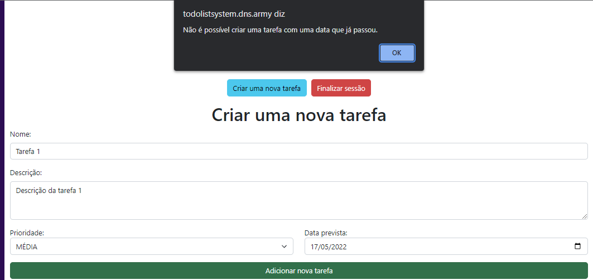

# O que é esse projeto?

Esse projeto é o frontend dessa [API RESTful](https://github.com/Matysys/todolist-system-api-backend) que eu também desenvolvi. O frontend vai consumir a API de lista de tarefas e organizar as informações para o usuário. O sistema está responsivo para mobile com a utilização do Bootstrap 5. O DOM foi manipulado manualmente com JavaScript Vanilla sem nenhum framework para isso.

O que há no projeto:
- [X] Tela de login
- [X] Tela de cadastro
- [X] Tela de lista de tarefas

# Tecnologias usadas
- [X] HTML
- [X] CSS
- [X] JavaScript
- [X] Bootstrap 5
- [X] Biblioteca Axios
- [X] Biblioteca Highcharts
- [X] Servidor Web Apache (SOMENTE ao utilizar com Docker)
- [X] Docker

# Como executar o projeto?

##### Clonando o repositório:

```
git clone https://github.com/Matysys/todo-system-frontend.git
```

##### Via Docker:

Tenha a porta 80 liberada no seu servidor ou localhost e tenha certeza que você tem o Docker e Docker Compose instalados, após isso execute o comando abaixo:

```
docker-compose up -d
```
Assim a página vai ficar disponível para ser acessada na porta 80 do IP público do seu servidor.
# Explicando as interfaces

### Interface de login


Um campo para email, um para senha, um botão de Login e um link para a tela de cadastro.

### Interface de login (login inválido)


Quando um login não é encontrado no banco de dados ou está incorreto.

### Interface de cadastro


Similar à interface de login, aqui exige um nome e confirmação de senha duas vezes antes de cadastrar um usuário. O e-mail precisa ser único no banco de dados, mas o nome não.

### Interface de cadastro (inválido)


SERÁ CORRIGIDO POSTERIORMENTE

Quando um usuário já existe no banco de dados.

### Interface de lista de tarefas (vazia)


### Interface de lista de tarefas (com tarefas)


### Interface de lista de tarefas (uma completa)


Como pode ser visto, há um gráfico de colunas feito utilizando a biblioteca ```Highcharts``` que mostra a quantidade de tarefas de acordo com a categoria.

Cada tarefa também tem uma cor diferente de acordo com a prioridade.
- Vermelho: ALTA
- Amarelo: MÉDIA
- Verde: BAIXA

Quando a tarefa é concluída, a cor é cinza.

## Interface de criação de tarefa

Vou simular uma lista nova, criar uma tarefa, alterar e depois deletar.
Há um botão embaixo do nome de usuário escrito ```Criar uma nova tarefa```. Ao clicar nele, um formulário vai aparecer embaixo:


- Nome da tarefa
- Descrição da tarefa
- Prioridade da tarefa
- Data prevista de conclusão da tarefa

É necessário preencher tudo sem deixar nenhum espaço em branco. Coloquei somente validação via HTML nesse projeto, mas uma no servidor pra validar a data, como no caso abaixo de uma data inválida:



A data foi 17/05/2022, uma data do passado.
Agora com uma data correta:


A nova tarefa vai aparecer e o gráfico será gerado.

### Como alterar, deletar e concluir a tarefa?

Em cada tarefa há uma imagem que serve como um botão:

- Lápis serve para alterar.
- A borracha serve para apagar.
- O sinal verde serve para concluir.


#### Editando uma tarefa

Clicando em cima do lápis amarelo, o formulário de alteração vai aparecer abaixo do gráfico:


Altere de acordo com o necessário, nesse caso vou mudar a prioridade de MÉDIA para BAIXA, a data de 20/05/2023 para 25/06/2023 e apertar no botão de alterar. Não se esqueça de respeitar a data válida como no exemplo de criação de tarefa.


A tarefa foi alterada e o gráfico foi atualizado!

### Completando uma tarefa

Vou criar outra tarefa, e logo em seguida apertar no botão para concluir a tarefa em questão.


É necessário a confirmação.


Acima está o resultado, e observe como é interessante a mudança do gráfico de colunas.

### Deletando uma tarefa

Agora vou apagar a Tarefa 1, veja abaixo:


É necessário confirmação.


Esse é o resultado. Eu optei por deixar as tarefas concluídas como histórico, então não podem ser deletadas.

### Finalizando a sessão

Há um botão no topo escrito ```Finalizar sessão```, ao clicar nele, o token será apagado do seu navegador e você voltará para o ```index.hmtl```.

Note que não é possível acessar a página de login enquanto estiver logado, porque eu implementei uma condição pra checar se o token já existe no navegador.

O método usado foi com o ```localStorage```, o JWT Token vai vir do servidor e será guardado no navegador no momento do login. Esse não é um método muito seguro, mas foi o método que optei por ser mais simples.

Ao logar, você consegue verificar o token pelo console digitando o seguinte:

```js
console.log(token)
```

Nesse token vai estar o id, nome e e-mail do usuário para identificação na hora de realizar as requisições.

##### Requisições HTTP

Utilizei a biblioteca ```Axios``` para facilitar nas requisições.

# Conclusão

É um frontend super simples somente para consumir a API e servir como aprendizado.


